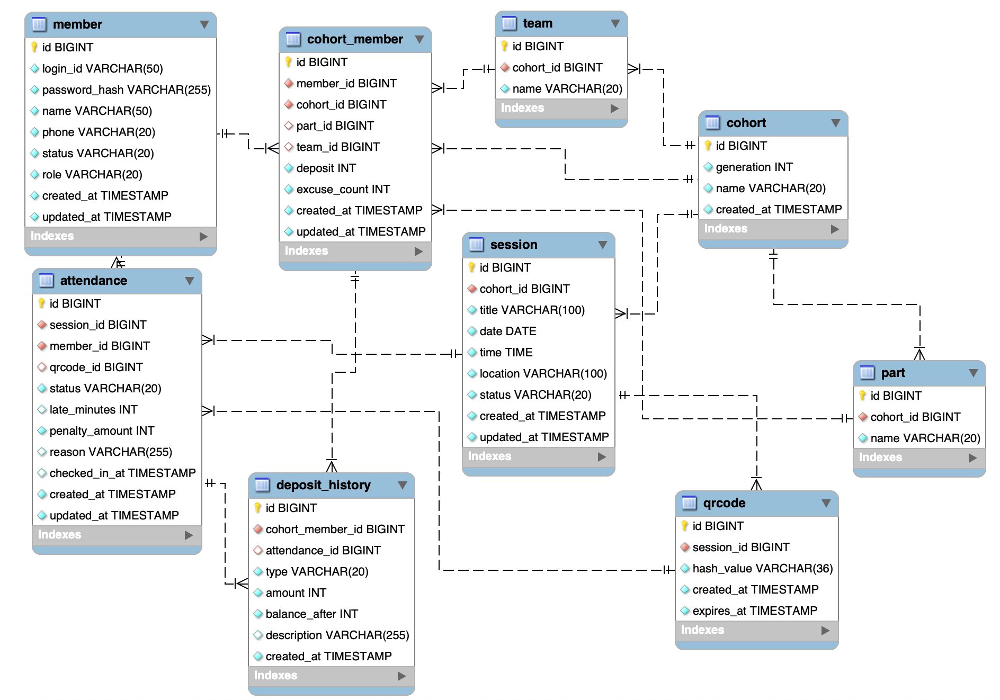

## ERD



## System Design Architecture

### 시스템 구성

```
+-------------------------+
|         Client          |
+-----------+-------------+
            |
            v
+-------------------------+
| Application / Business  |
|          Layer          |
+-----------+-------------+
            |
            v
+-------------------------+
|        Data Layer       |
|          My SQL         |
+-------------------------+
```
요구사항 범위와 트래픽 규모를 고려해 **3‑티어 모놀로식**으로 설계하였습니다.

프로그라피에 대해 좀 더 조사해본 결과 실제 한 기수에 100 이내의 사람들이 출결 서비스를 이용할 거라 생각했습니다.

그렇다면 출석 시간이 다가올수록 한순의 스파이크가 생기고 그 외에는 부하가 발생하지 않는다고 판단했습니다.

그래서 과도한 설계보단 모놀로식으로 설계하는 방향이 현재는 더 타당하다고 생각했습니다.

또한 지금은 H2로 테스트용 DB를 사용하지만 실제 운영 환경에서는 MySQL 등 영속성 DB를 사용하는 것이 적합하다고 판단됩니다.

## AI 사용 내역

### AI 활용 방식
- Codex CLI를 활용하여 작업하였습니다. 
- 작업하면서 직접 기능 요구를 정의하고, AI를 활용해 초안 작성과 반복 작업 보조에 사용하였습니다.
- AI는 도메인별 API/서비스/DTO/테스트 코드 작성 속도를 높이는 보조 도구로 활용했습니다.
- 최종 구조 결정과 머지는 AI가 아닌 직접 확인하고 수행하였습니다.

### 작업 범위
- 출결(Attendance) 도메인 API/DTO/Mapper/Facade 및 테스트
- 세션(Session)·QR 코드 도메인 API/DTO/Mapper/Facade 및 테스트
- 회원(Member) 관리/조회 API/DTO/Mapper/Facade 및 테스트
- 보증금(Deposit) 조회 API 및 응답 매핑
- 시드 데이터 초기화 SQL 작성 및 설정 반영
- README 실행 방법, 고민/생각 정리 문서 작성
- Postman 컬렉션 JSON 생성

## 구현 중 고민/생각 정리

### 1) 도메인 분리

* `domain/{attendance, auth, cohort, member, ...}` 단위로 controller / dto / entity / repository / service를 묶어 기능 경계를 명확히 구분했습니다.
- 이렇게 하면 기능별 변경 영향 범위가 작아져 유지보수성과 코드 탐색 효율이 높아져 불필요한 탐색 시간을 단축할 수 있습니다.

### 2) Facade 도입

* 컨트롤러는 `*FacadeService`만 호출하도록 구성했고, 파사드가 여러 도메인 서비스를 조합해 유스케이스 단위의 오케스트레이션과 응답 조립을 담당하도록 설계했습니다.
* **장점**: 여러 복합적인 서비스 로직들을 참조하는게 아닌 하나의 큰 서비스 로직을 참조하므로 유지 보수성에서 좋은 코드라 판단해 파서드 패턴을 사용하였습니다.

### 3) 운영 기수 고정 vs 다기수 데이터 구조

* 정책상 현재 운영 기수는 11기로 고정되어 있지만, 시드 데이터에는 10기와 11기를 함께 구성했습니다.
* “회원은 여러 기수에 참여할 수 있다”는 확장 가능성을 고려해 `CohortMember` 중간 테이블(N:M 구조)을 유지했습니다.
* 과거·미래 기수 데이터 시뮬레이션 및 다기수 조회 요구에 유연하게 대응할 수 있는 구조를 확보했습니다.

### 4) 운영 기수 고정 정책의 API 설계 반영

* 현재 운영 기수는 설정값으로 결정되기 때문에, API에서는 기수 파라미터를 받지 않도록 설계했습니다.
* 이를 통해 호출 측을 단순화할 수 있었고, 정책 위반 가능성을 줄일 수 있었습니다.

### 5) QR 유효기간 및 단일 활성 QR 제약

* QR 코드는 24시간 유효하도록 설정했고, 한 일정당 활성 QR은 1개만 허용했습니다.
* QR 갱신 시 기존 QR을 즉시 만료 처리한 뒤 새로운 QR을 발급하도록 구현했습니다.
* 이를 통해 현장 운영 시 혼선과 중복 출석 가능성을 줄일 수 있었습니다.


